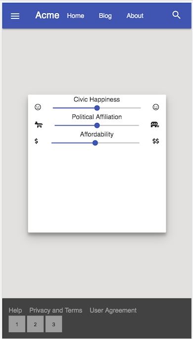
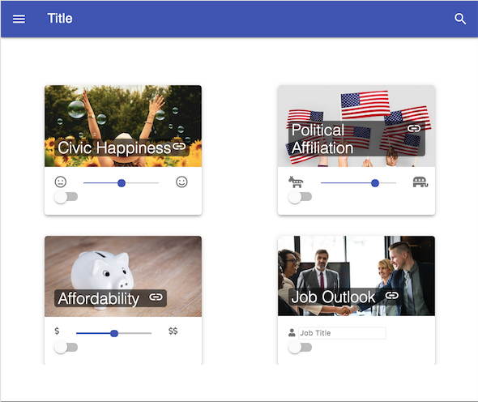

# utbc2019-mdl-play

Play with material design lite in preparation for MD and React.

I'm following along in this (somewhat dated circa 2015) navbar [tutorial](https://webdesign.tutsplus.com/tutorials/learning-material-design-lite-navigation--cms-24565).

## Early screen shot

## Blessed Internet

I find a nice responsive codepen somewhere on the internet that features a CSS grid and images of Bill Murray, both in my inspirational wheel house.

