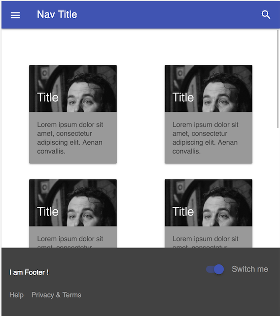

# utbc2019-mdl-play

Play with material design lite in preparation for MD and React.

I'm following along in this (somewhat dated circa 2015) navbar [tutorial](https://webdesign.tutsplus.com/tutorials/learning-material-design-lite-navigation--cms-24565).

## Early screen shot

I've found this nice responsive codepen on the internet that features a CSS grid which should suit my purposes nicely (even though I'm big on flexbox at the moment) ...

## Latest fu

I would /really/ like to redesign the user interface for project 1.  It's fine especially given that we only had 2 weeks to knock it out.  But I'm jones'ing for some MDL and so I'm pushing forward.

